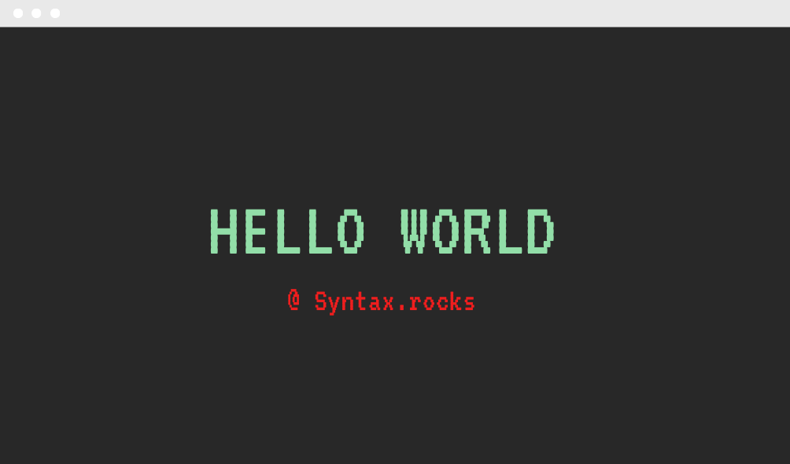

[4nnt4](https://twitter.com/4nnt4) created [Syntax.Rocks](https://syntax.rocks) as a place where developers could collaborate with one another to horn their skills in their domain. From basics of coding with different languages to deep concepts in programming, [Syntax.Rocks](https://syntax.rocks) tries to deliver an easy experience to developers learning these concepts to get better at their craft.
